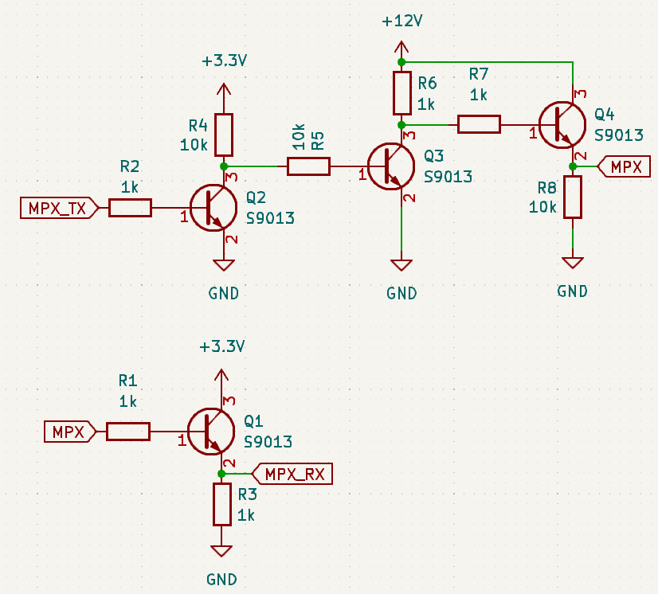
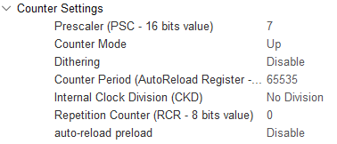
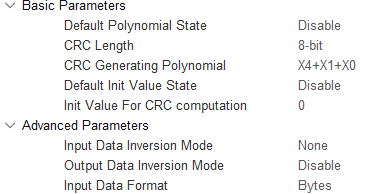

# BeanMPX-STM32
Implementation of Toyota's Bean MPX protocol on the STM32

Ported from the AVR https://github.com/specadmin/toyota-mpx/tree/master

## Electrical interface



MPX_RX must be connected to a GPIO input configured as an external interrupt, capable of triggering on rising and falling edges.
MPX_TX can be any GPIO output.

## Code

Clone the repository into your project directory (usually under the Drivers folder), and include in the compilation paths.

Label one GPIO input pin as MPX_RX and set it as an external interrupt on rising and falling edges.
Label another GPIO output pin as MPX_TX.

Create a timer that has a frequency which will produce integers for the timing of a full bit and half bit at 10kbps, with an interrupt in CubeIDE. For example with a 160Mhz peripheral clock:

F_CLK = 160000000 hz

MPX_BAUD = 10000 bps

PSC = 7

ARR = 65535 (Set to the maximum value, the driver will auto adjust this as required to the full and half bit values below)

Full Bit = F_CLK / (PSC + 1) / MPX_BAUD - 1 = 1999

Half Bit = F_CLK / (PSC + 1) / MPX_BAUD / 2 - 1 = 999



(Optional) Setup the CRC peripheral to have a length of 8-bits, a polynomal of X4+X1+X0, default value of 0, and input data format in bytes.



Set the following definitions in main.h
```C++
#define MPX_TIM_HANDLE htim16 /*Set to the timer handle*/
#define MPX_CLK 20000000UL /*Frequency of each count for the timer referred to by MPX_TIM_HANDLE, ie FCLK / (PSC + 1)*/
#define MPX_CRC_HANDLE hcrc /*If your STM32 has hardware CRC, otherwise comment out to disable hardware crc*/
```

Include mpx.h in your main.c and setup the interrupt handlers in main.c to call mpx_rx_interrupt() on the rising and falling edges of the 
MPX_RX pin and mpx_timer_interrupt() when the timer referred to by MPX_TIM_HANDLE overflows.

Initialise the MPX driver calling mpx_init() with an optional callback function that is invoked upon recieving valid frames.

Use mpx_send() to send data on the bus, with an optional callback.

## Sample main.c

```C++
#include "main.h"
#include "mpx.h"

...

void HAL_GPIO_EXTI_Falling_Callback(uint16_t GPIO_Pin) {
  switch(GPIO_Pin) {
    case MPX_RX_Pin:
      mpx_rx_interrupt();
      break;
    default:
      break;
  }
}

void HAL_GPIO_EXTI_Rising_Callback(uint16_t GPIO_Pin) {
  switch(GPIO_Pin) {
    case MPX_RX_Pin:
      mpx_rx_interrupt();
      break;
    default:
      break;
  }
}

void HAL_TIM_PeriodElapsedCallback(TIM_HandleTypeDef* htim) {
  if(htim == &MPX_TIM_HANDLE) {
    mpx_timer_interrupt();
  }
}

void mpx_rx(uint8_t size, const uint8_t* buff) {
  printf("MPX RX: %d |", size);
  for (uint8_t i = 0; i<size; i++) {
    printf(" %#02x", buff[i]);
  }
  printf("\n");
}

void mpx_tx(uint8_t result) {
  printf("MPX TX Status: %d\n", result);
}

...

int main(void) {
  HAL_Init();

  ...

  uint8_t engTemp[]  =  {0x2C, 0xA5}; //Send data to move the engine temperature needle to 165 degrees
  mpx_init(mpx_rx);
  while(1) {
    mpx_send(0xFE, sizeof(engTemp), engTemp, mpx_tx);
    HAL_Delay(250);
  }
  return 0;
}
```
